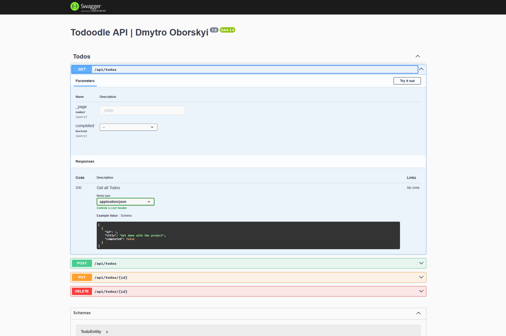

# **[Todoodle](https://github.com/EcchiGrill/todoodle)** Planner API

This is the **backend** for **[Todoodle](https://github.com/EcchiGrill/todoodle)** application built with **NestJS** and **REST API**. It handles authentication, content management, and API endpoints for the frontend.

<p align="center">
  <a href="http://localhost:4200/api/docs" target="_blank"></a>
</p>

## 🏗️ Getting Started

Follow these steps to run the backend locally:

### 1️⃣ Clone repo and navigate to the root directory

```bash
git clone https://github.com/EcchiGrill/todoodle-api
cd todoodle-api
```

### 2️⃣ Configure Environment Variables

Create a **.env** file and add variables mentioned in **.env.example**

### 3️⃣ Generate Prisma Client

Before running the server, generate the Prisma client:

```bash
npx prisma generate
```

### 4️⃣ Start the Development Server

Using Yarn:

```bash
yarn dev
```

Or using npm:

```bash
npm run dev
```

## The backend will be available at:

- 🔗 API: **[localhost:4200/api](http://localhost:4200/api)**
- 🔗 Swagger API Docs: **[localhost:4200/api/docs](http://localhost:4200/api/docs)**
